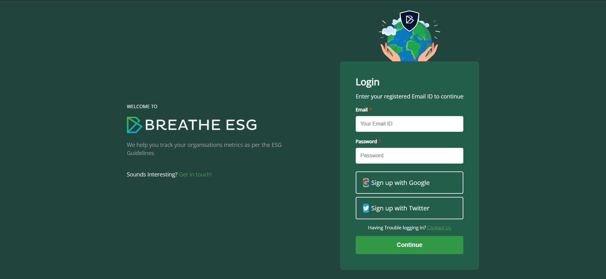
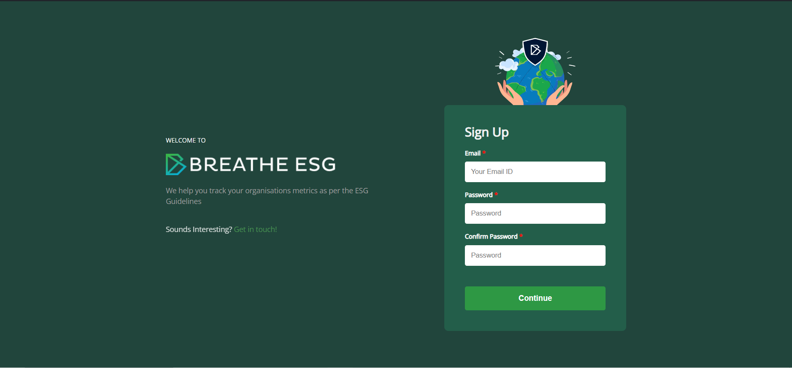
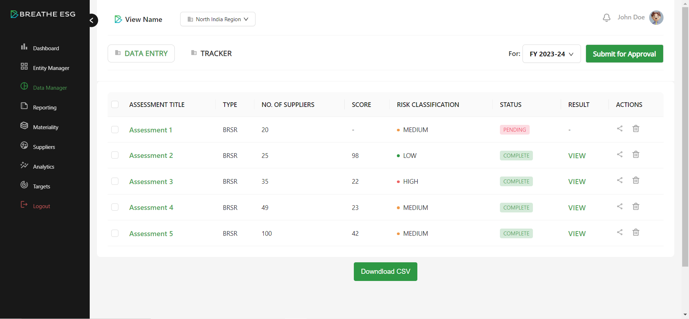
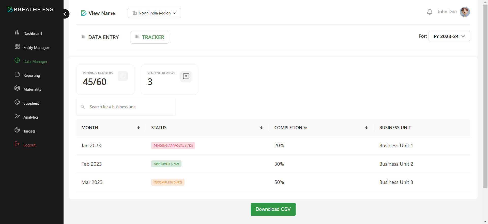

# Breathe esg

It is a single page wep app for assessment, ensuring better readability and ui.

# Overview









## Login

1. For an overview: 
    - Login using the sample auth user 
        - email: admin@gmail.com
        - password: admin

2. To create a new account go to https://breathe-esg-web.vercel.app/signup from the address bar of the browser.

## Technologies Used

- React.JS
- TypeScript
- Redux
- CSS
- Ant Design (AntD)

## Key Features:

1. **Auth using JWTs:**
   - Authentication using JSON Web Tokens (JWTs).
   - Access and refresh token for seamless experience.

2. **State Management using Redux:**
   - State management using Redux.

3. **Type-Safe JavaScript using TypeScript:**
   - Utilization of TypeScript for type-safe JavaScript, enhancing code quality and maintainability.

5. **Deployed Frontend:**
   - The frontend is deployed on Vercel.

6. **Data export:**
    - Added feature for exporting the data is a csv format.

# Getting Started

To run the project locally, follow these steps:

1. Clone the repository:
   ```bash
   git clone https://github.com/roshan3216/breathe-esg.git

2. Install Dependencies
    ```bash
    cd breathe-esg
    npm install

3. Start the Development Server
    ```bash
    npm start

## Deployment

The application is deployed on Vercel. [Link to Vercel Deployment](https://breathe-esg-web.vercel.app/)